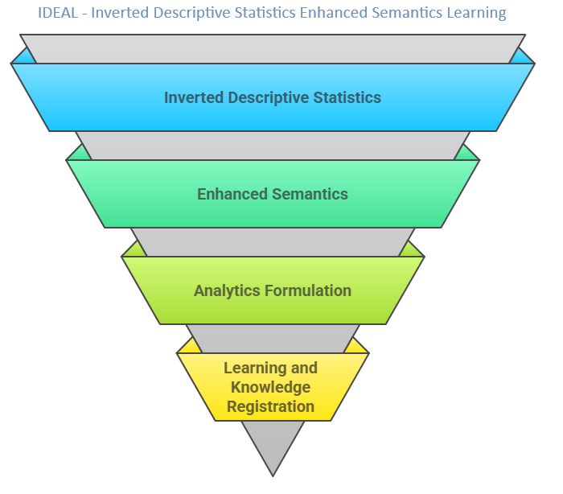

    
# Ai Test Framework 

## Establishes infrastructure for testing AI platform.

    

    

## Architecture Overview	
## The Brain 	
	1.	What we showed last time (2 months ago)
	2.	whats built and available
	3.	What is turned on and why 
##	Ethical Guardrails & Domain Topic Classifier	
		1 Sexism, 2 racism, 3 innappropriate, 4 hostility, 5 practicing medicine, 6  PHI
		7. Domain 8. Topic = Chatbot intent
##	Ground Truth - 1863 Validated Questions	
##	Imperical Score Card 	
	1.	**Domain Scorecard** - Big Picture
	2.	**Topic Scorecard** - What areas need improvement
##	Demo -  lines of questioning	
	1.	Health Care  - how many smokers in wny 
	2.	Health Care  - how many children  smokers in wny 
	3.	Penguins   - average beak size per species  
	4.	Titanic  -Average age of passengers
	5.	Penguins -Species by island
	6.	Health Care - Smokers by gender
	7.	Health Care  - Types of cancer
	8.	count of IDA_state disparity 
	9.	Titanic  -survivors by pclass
	10.	Health Care - Smokers by gender and age decade
## Demo -  System Features	
	1.	Show SQL
	2.	Show Table
	3.	Show Graph
	4.	Recommended questions 
	5.	Follow up question 
	6.	Prior questions 
##	Next steps - Training and Hyper parameter tuning  	
	1.	Establishing role based security
	2.	establishing HEL AWS hosting infrastructure
	3.	connecting to HEL database live
	4.	Training on external source  - Understanding wny geography
	5.	Training on IDA - understanding disparity
    6.	Preparing documentation for state
	7.	establishing pilot group 1
	8.	establishing pilot group 2

 

## Layering Intelligence

Building a super intelligent AI assistant involves integrating various layers of artificial intelligence technologies, each contributing uniquely to the assistants capabilities. These layers collectively enhance the assistants ability to understand, process, and respond to user inputs in a meaningful way. Heres an enumerated list of AI layers that you might consider for such a system

1. **Natural Language Processing (NLP)**
    **Purpose** Enables the AI to understand and generate human language. Its used for parsing, understanding context, sentiment analysis, and generating coherent, contextually appropriate responses.
    **Application** Can be used to answer general questions, assist in tasks like booking appointments, and understand user commands or queries.

2. **Machine Learning Classifiers**
    **Purpose** Classifies inputs into predefined categories based on learned patterns from data.
    **Application** Identifies the intent behind queries or commands, categorizes user requests, and triggers appropriate workflows or responses.

3. **Neural Networks**
    **Purpose** Models complex patterns and predictions using layers of neurons. Essential for deep learning tasks.
    **Application** Powers complex decisionmaking processes, image and speech recognition, and can enhance the personalization of responses based on user behavior and preferences.

4. **Generative AI**
    **Purpose** Uses models like GPT (Generative Pretrained Transformer) to generate text that mimics human writing styles and content generation.
    **Application** Used to create detailed and nuanced responses to user queries, generate creative content, or even draft emails and reports.

5. **Speech Recognition**
    **Purpose** Converts spoken language into text. This is crucial for voiceactivated systems.
    **Application** Allows users to interact with the AI assistant through voice commands, making the assistant accessible in handsfree scenarios like driving or cooking.

6. **Recommendation Systems**
    **Purpose** Analyzes patterns in user data to predict and recommend relevant items or actions.
    **Application** Suggests actions, answers, or content based on the users past behavior, enhancing user experience by personalizing interactions.

7. **Query Generation for Databases**
    **Purpose** Automatically formulates and executes database queries based on user commands or questions.
    **Application** Retrieves and manipulates data from internal or external databases without manual SQL input, useful in business intelligence and datadriven decisionmaking.

8. **Semantic Analysis**
    **Purpose** Goes beyond basic keyword recognition to understand the deeper meaning and relationships in text.
    **Application** Helps in understanding complex queries, resolving ambiguities in human language, and ensuring the context is maintained across conversations.

9. **Emotion and Sentiment Analysis**
    **Purpose** Analyzes the emotional tone behind texts or spoken inputs.
    **Application** Adjusts responses based on the users emotional state or sentiment, which is particularly useful in customer service scenarios.

10. **Robot Process Automation (RPA)**
     **Purpose** Automates repetitive tasks by mimicking human interactions with digital systems.
     **Application** Handles routine backend tasks triggered by user requests, such as booking tickets or updating records, efficiently and without human error.

By layering these technologies, a super intelligent AI assistant can perform a wide range of tasks, from simple question answering to complex problem solving and personalized interactions. Each layer enhances the systems ability to understand and interact in more humanlike ways, leading to richer user experiences and more effective assistance.

## Layering Intelligence

Building a super intelligent AI assistant involves integrating various layers of artificial intelligence technologies, each contributing uniquely to the assistants capabilities. These layers collectively enhance the assistants ability to understand, process, and respond to user inputs in a meaningful way. Heres an enumerated list of AI layers that you might consider for such a system

1. **Natural Language Processing (NLP)**
    **Purpose** Enables the AI to understand and generate human language. Its used for parsing, understanding context, sentiment analysis, and generating coherent, contextually appropriate responses.
    **Application** Can be used to answer general questions, assist in tasks like booking appointments, and understand user commands or queries.

2. **Machine Learning Classifiers**
    **Purpose** Classifies inputs into predefined categories based on learned patterns from data.
    **Application** Identifies the intent behind queries or commands, categorizes user requests, and triggers appropriate workflows or responses.

3. **Neural Networks**
    **Purpose** Models complex patterns and predictions using layers of neurons. Essential for deep learning tasks.
    **Application** Powers complex decisionmaking processes, image and speech recognition, and can enhance the personalization of responses based on user behavior and preferences.

4. **Generative AI**
    **Purpose** Uses models like GPT (Generative Pretrained Transformer) to generate text that mimics human writing styles and content generation.
    **Application** Used to create detailed and nuanced responses to user queries, generate creative content, or even draft emails and reports.

5. **Speech Recognition**
    **Purpose** Converts spoken language into text. This is crucial for voiceactivated systems.
    **Application** Allows users to interact with the AI assistant through voice commands, making the assistant accessible in handsfree scenarios like driving or cooking.

6. **Recommendation Systems**
    **Purpose** Analyzes patterns in user data to predict and recommend relevant items or actions.
    **Application** Suggests actions, answers, or content based on the users past behavior, enhancing user experience by personalizing interactions.

7. **Query Generation for Databases**
    **Purpose** Automatically formulates and executes database queries based on user commands or questions.
    **Application** Retrieves and manipulates data from internal or external databases without manual SQL input, useful in business intelligence and datadriven decisionmaking.

8. **Semantic Analysis**
    **Purpose** Goes beyond basic keyword recognition to understand the deeper meaning and relationships in text.
    **Application** Helps in understanding complex queries, resolving ambiguities in human language, and ensuring the context is maintained across conversations.

9. **Emotion and Sentiment Analysis**
    **Purpose** Analyzes the emotional tone behind texts or spoken inputs.
    **Application** Adjusts responses based on the users emotional state or sentiment, which is particularly useful in customer service scenarios.

10. **Robot Process Automation (RPA)**
     **Purpose** Automates repetitive tasks by mimicking human interactions with digital systems.
     **Application** Handles routine backend tasks triggered by user requests, such as booking tickets or updating records, efficiently and without human error.

By layering these technologies, a super intelligent AI assistant can perform a wide range of tasks, from simple question answering to complex problem solving and personalized interactions. Each layer enhances the systems ability to understand and interact in more humanlike ways, leading to richer user experiences and more effective assistance.

## Layering Intelligence

Building a super intelligent AI assistant involves integrating various layers of artificial intelligence technologies, each contributing uniquely to the assistants capabilities. These layers collectively enhance the assistants ability to understand, process, and respond to user inputs in a meaningful way. Heres an enumerated list of AI layers that you might consider for such a system

1. **Natural Language Processing (NLP)**
    **Purpose** Enables the AI to understand and generate human language. Its used for parsing, understanding context, sentiment analysis, and generating coherent, contextually appropriate responses.
    **Application** Can be used to answer general questions, assist in tasks like booking appointments, and understand user commands or queries.

2. **Machine Learning Classifiers**
    **Purpose** Classifies inputs into predefined categories based on learned patterns from data.
    **Application** Identifies the intent behind queries or commands, categorizes user requests, and triggers appropriate workflows or responses.

3. **Neural Networks**
    **Purpose** Models complex patterns and predictions using layers of neurons. Essential for deep learning tasks.
    **Application** Powers complex decisionmaking processes, image and speech recognition, and can enhance the personalization of responses based on user behavior and preferences.

4. **Generative AI**
    **Purpose** Uses models like GPT (Generative Pretrained Transformer) to generate text that mimics human writing styles and content generation.
    **Application** Used to create detailed and nuanced responses to user queries, generate creative content, or even draft emails and reports.

5. **Speech Recognition**
    **Purpose** Converts spoken language into text. This is crucial for voiceactivated systems.
    **Application** Allows users to interact with the AI assistant through voice commands, making the assistant accessible in handsfree scenarios like driving or cooking.

6. **Recommendation Systems**
    **Purpose** Analyzes patterns in user data to predict and recommend relevant items or actions.
    **Application** Suggests actions, answers, or content based on the users past behavior, enhancing user experience by personalizing interactions.

7. **Query Generation for Databases**
    **Purpose** Automatically formulates and executes database queries based on user commands or questions.
    **Application** Retrieves and manipulates data from internal or external databases without manual SQL input, useful in business intelligence and datadriven decisionmaking.

8. **Semantic Analysis**
    **Purpose** Goes beyond basic keyword recognition to understand the deeper meaning and relationships in text.
    **Application** Helps in understanding complex queries, resolving ambiguities in human language, and ensuring the context is maintained across conversations.

9. **Emotion and Sentiment Analysis**
    **Purpose** Analyzes the emotional tone behind texts or spoken inputs.
    **Application** Adjusts responses based on the users emotional state or sentiment, which is particularly useful in customer service scenarios.

10. **Robot Process Automation (RPA)**
     **Purpose** Automates repetitive tasks by mimicking human interactions with digital systems.
     **Application** Handles routine backend tasks triggered by user requests, such as booking tickets or updating records, efficiently and without human error.

By layering these technologies, a super intelligent AI assistant can perform a wide range of tasks, from simple question answering to complex problem solving and personalized interactions. Each layer enhances the systems ability to understand and interact in more humanlike ways, leading to richer user experiences and more effective assistance.

The proposed 5layer data validation technique offers a comprehensive approach to ensuring data quality and accuracy across various stages. Below, I will refine and expand each layer to address potential gaps and enhance the robustness of the validation process

### Layer 1 Descriptive Statistics and Ground Truth Establishment
 **Enhanced Approach** Utilize `pandas.describe()` to compute summary statistics (mean, median, standard deviation, quartiles) for all numeric columns in the dataset. Establish ground truth by comparing these statistics against historical data or expected ranges predefined by domain experts. Include additional statistical tests such as Zscores or Ttests for anomaly detection, where deviations from historical norms are flagged for further review.

### Layer 2 SQL Database Integrity and Consistency Check
 **Enhanced Approach** Perform SQL queries to replicate the descriptive statistics calculated in Layer 1 directly from the database. Use assertions in SQL to check that aggregates (sum, average, count, min, max) match those calculated in pandas. Include integrity checks for data types, null values, and referential integrity (e.g., foreign keys). Implement checksum or hash comparisons for entire datasets or critical subsets to ensure no discrepancies between the source data and what is loaded into the database.

### Layer 3 External Validation with Semantic Analysis
 **Refined Approach** Instead of relying on potentially unavailable external internet sources for proprietary data, use semantic analysis technologies to validate data consistency and plausibility. This can involve using NLP tools to understand text datas context and meaning, comparing against a corpus of industryspecific documentation or previously validated datasets. For nonproprietary information, leverage external APIs or datasets for crossreferencing facts.

### Layer 4 Expert Review and Feedback Loop
 **Enhanced Approach** Involve clinical SMEs or domain experts to manually review a random, statistically significant sample of the data, focusing on entries flagged by previous layers as anomalies or outliers. Use their feedback not only to validate the data but also to iteratively improve the data collection and cleaning processes. Record expert feedback and decisions in a learning database to refine the automated checks in Layers 1 and 2.

### Layer 5 Continuous Learning and Model Adjustment
 **New Layer Introduction** Implement machine learning models to predict data quality issues based on patterns identified in historical corrections (from Layer 4 feedback and Layer 1 anomalies). Continuously train and adjust these models as new data and feedback become available. Use this layer to proactively suggest potential errors and improve the overall resilience of the data validation framework.

### Implementing the Approach
1. **Automation and Monitoring** Automate as much of the validation process as possible, especially for Layers 1, 2, and 3. Implement monitoring dashboards to track the status and outcomes of validations, highlighting trends over time and identifying areas for improvement.
2. **Data Governance** Establish a clear data governance framework that outlines the roles and responsibilities for each layer, ensuring that data checks are performed regularly and systematically.
3. **Tool Integration** Integrate validation tools directly into data pipelines and ETL processes. This integration ensures that data quality checks are part of the daily workflow and not a separate, potentially overlooked process.

By refining these layers and introducing a continuous learning component, the data validation technique becomes not only more robust but also adaptive to changes in data patterns and external conditions, ultimately leading to higher data quality and trustworthiness in analytical and operational use cases.

Vanna.AI integrates with Large Language Models (LLMs) to facilitate natural language interactions with SQL databases. Heres an overview of how Vanna.AI interacts with LLMs

**1. RetrievalAugmented Generation (RAG) Framework**
Vanna.AI employs a Retrieval Augmented Generation approach, combining LLMs with a retrieval system to enhance SQL query generation. This involves training the model on Data Definition Language (DDL) statements, documentation, and example SQL queries to provide context to the LLM.  

**2. Extensible LLM Integration**
Vanna.AI is designed to be extensible, allowing users to integrate various LLMs based on their preferences or requirements. Users can implement custom LLM classes by extending the `VannaBase` class and defining methods such as `submit_prompt` to handle prompt submissions to the chosen LLM.  

**3. Local and Offline Operation**
For environments requiring offline operation, Vanna.AI can be configured to work with local LLMs. For instance, integrating with Ollama enables the use of LLMs without internet connectivity, ensuring data privacy and security.  

**4. Data Security Considerations**
When using Vannas hosted services, training data such as DDL statements, documentation strings, and SQL queries are stored on Vannas servers. However, database contents are not sent to Vannas servers or the LLM unless explicitly allowed by the user, ensuring control over sensitive information.  

In summary, Vanna.AI interacts with LLMs through a flexible framework that supports various LLM integrations, retrievalaugmented generation for contextaware SQL generation, and options for both online and offline operations, all while maintaining robust data security practices. 

**Retrieval augmented generation (RAG)** is a technique that grants generative artificial intelligence models information retrieval capabilities. It modifies interactions with a large language model (LLM) so that the model responds to user queries with reference to a specified set of documents, using this information to augment information drawn from its own vast, static training data. This allows LLMs to use domainspecific andor updated information.[1] Use cases include providing chatbot access to internal company data or giving factual information only from an authoritative source.[2]

## Layering Intelligence

Building a super intelligent AI assistant involves integrating various layers of artificial intelligence technologies, each contributing uniquely to the assistants capabilities. These layers collectively enhance the assistants ability to understand, process, and respond to user inputs in a meaningful way. Heres an enumerated list of AI layers that you might consider for such a system

1. **Natural Language Processing (NLP)**
    **Purpose** Enables the AI to understand and generate human language. Its used for parsing, understanding context, sentiment analysis, and generating coherent, contextually appropriate responses.
    **Application** Can be used to answer general questions, assist in tasks like booking appointments, and understand user commands or queries.

2. **Machine Learning Classifiers**
    **Purpose** Classifies inputs into predefined categories based on learned patterns from data.
    **Application** Identifies the intent behind queries or commands, categorizes user requests, and triggers appropriate workflows or responses.

3. **Neural Networks**
    **Purpose** Models complex patterns and predictions using layers of neurons. Essential for deep learning tasks.
    **Application** Powers complex decisionmaking processes, image and speech recognition, and can enhance the personalization of responses based on user behavior and preferences.

4. **Generative AI**
    **Purpose** Uses models like GPT (Generative Pretrained Transformer) to generate text that mimics human writing styles and content generation.
    **Application** Used to create detailed and nuanced responses to user queries, generate creative content, or even draft emails and reports.

5. **Speech Recognition**
    **Purpose** Converts spoken language into text. This is crucial for voiceactivated systems.
    **Application** Allows users to interact with the AI assistant through voice commands, making the assistant accessible in handsfree scenarios like driving or cooking.

6. **Recommendation Systems**
    **Purpose** Analyzes patterns in user data to predict and recommend relevant items or actions.
    **Application** Suggests actions, answers, or content based on the users past behavior, enhancing user experience by personalizing interactions.

7. **Query Generation for Databases**
    **Purpose** Automatically formulates and executes database queries based on user commands or questions.
    **Application** Retrieves and manipulates data from internal or external databases without manual SQL input, useful in business intelligence and datadriven decisionmaking.

8. **Semantic Analysis**
    **Purpose** Goes beyond basic keyword recognition to understand the deeper meaning and relationships in text.
    **Application** Helps in understanding complex queries, resolving ambiguities in human language, and ensuring the context is maintained across conversations.

9. **Emotion and Sentiment Analysis**
    **Purpose** Analyzes the emotional tone behind texts or spoken inputs.
    **Application** Adjusts responses based on the users emotional state or sentiment, which is particularly useful in customer service scenarios.

10. **Robot Process Automation (RPA)**
     **Purpose** Automates repetitive tasks by mimicking human interactions with digital systems.
     **Application** Handles routine backend tasks triggered by user requests, such as booking tickets or updating records, efficiently and without human error.

By layering these technologies, a super intelligent AI assistant can perform a wide range of tasks, from simple question answering to complex problem solving and personalized interactions. Each layer enhances the systems ability to understand and interact in more humanlike ways, leading to richer user experiences and more effective assistance.

The proposed 5layer data validation technique offers a comprehensive approach to ensuring data quality and accuracy across various stages. Below, I will refine and expand each layer to address potential gaps and enhance the robustness of the validation process

### Layer 1 Descriptive Statistics and Ground Truth Establishment
 **Enhanced Approach** Utilize `pandas.describe()` to compute summary statistics (mean, median, standard deviation, quartiles) for all numeric columns in the dataset. Establish ground truth by comparing these statistics against historical data or expected ranges predefined by domain experts. Include additional statistical tests such as Zscores or Ttests for anomaly detection, where deviations from historical norms are flagged for further review.

### Layer 2 SQL Database Integrity and Consistency Check
 **Enhanced Approach** Perform SQL queries to replicate the descriptive statistics calculated in Layer 1 directly from the database. Use assertions in SQL to check that aggregates (sum, average, count, min, max) match those calculated in pandas. Include integrity checks for data types, null values, and referential integrity (e.g., foreign keys). Implement checksum or hash comparisons for entire datasets or critical subsets to ensure no discrepancies between the source data and what is loaded into the database.

### Layer 3 External Validation with Semantic Analysis
 **Refined Approach** Instead of relying on potentially unavailable external internet sources for proprietary data, use semantic analysis technologies to validate data consistency and plausibility. This can involve using NLP tools to understand text datas context and meaning, comparing against a corpus of industryspecific documentation or previously validated datasets. For nonproprietary information, leverage external APIs or datasets for crossreferencing facts.

### Layer 4 Expert Review and Feedback Loop
 **Enhanced Approach** Involve clinical SMEs or domain experts to manually review a random, statistically significant sample of the data, focusing on entries flagged by previous layers as anomalies or outliers. Use their feedback not only to validate the data but also to iteratively improve the data collection and cleaning processes. Record expert feedback and decisions in a learning database to refine the automated checks in Layers 1 and 2.

### Layer 5 Continuous Learning and Model Adjustment
 **New Layer Introduction** Implement machine learning models to predict data quality issues based on patterns identified in historical corrections (from Layer 4 feedback and Layer 1 anomalies). Continuously train and adjust these models as new data and feedback become available. Use this layer to proactively suggest potential errors and improve the overall resilience of the data validation framework.

### Implementing the Approach
1. **Automation and Monitoring** Automate as much of the validation process as possible, especially for Layers 1, 2, and 3. Implement monitoring dashboards to track the status and outcomes of validations, highlighting trends over time and identifying areas for improvement.
2. **Data Governance** Establish a clear data governance framework that outlines the roles and responsibilities for each layer, ensuring that data checks are performed regularly and systematically.
3. **Tool Integration** Integrate validation tools directly into data pipelines and ETL processes. This integration ensures that data quality checks are part of the daily workflow and not a separate, potentially overlooked process.

By refining these layers and introducing a continuous learning component, the data validation technique becomes not only more robust but also adaptive to changes in data patterns and external conditions, ultimately leading to higher data quality and trustworthiness in analytical and operational use cases.

Vanna.AI integrates with Large Language Models (LLMs) to facilitate natural language interactions with SQL databases. Heres an overview of how Vanna.AI interacts with LLMs

**1. RetrievalAugmented Generation (RAG) Framework**
Vanna.AI employs a Retrieval Augmented Generation approach, combining LLMs with a retrieval system to enhance SQL query generation. This involves training the model on Data Definition Language (DDL) statements, documentation, and example SQL queries to provide context to the LLM.  

**2. Extensible LLM Integration**
Vanna.AI is designed to be extensible, allowing users to integrate various LLMs based on their preferences or requirements. Users can implement custom LLM classes by extending the `VannaBase` class and defining methods such as `submit_prompt` to handle prompt submissions to the chosen LLM.  

**3. Local and Offline Operation**
For environments requiring offline operation, Vanna.AI can be configured to work with local LLMs. For instance, integrating with Ollama enables the use of LLMs without internet connectivity, ensuring data privacy and security.  

**4. Data Security Considerations**
When using Vannas hosted services, training data such as DDL statements, documentation strings, and SQL queries are stored on Vannas servers. However, database contents are not sent to Vannas servers or the LLM unless explicitly allowed by the user, ensuring control over sensitive information.  

In summary, Vanna.AI interacts with LLMs through a flexible framework that supports various LLM integrations, retrievalaugmented generation for contextaware SQL generation, and options for both online and offline operations, all while maintaining robust data security practices. 

## Layering Intelligence

Building a super intelligent AI assistant involves integrating various layers of artificial intelligence technologies, each contributing uniquely to the assistants capabilities. These layers collectively enhance the assistants ability to understand, process, and respond to user inputs in a meaningful way. Heres an enumerated list of AI layers that you might consider for such a system

1. **Natural Language Processing (NLP)**
    **Purpose** Enables the AI to understand and generate human language. Its used for parsing, understanding context, sentiment analysis, and generating coherent, contextually appropriate responses.
    **Application** Can be used to answer general questions, assist in tasks like booking appointments, and understand user commands or queries.

2. **Machine Learning Classifiers**
    **Purpose** Classifies inputs into predefined categories based on learned patterns from data.
    **Application** Identifies the intent behind queries or commands, categorizes user requests, and triggers appropriate workflows or responses.

3. **Neural Networks**
    **Purpose** Models complex patterns and predictions using layers of neurons. Essential for deep learning tasks.
    **Application** Powers complex decisionmaking processes, image and speech recognition, and can enhance the personalization of responses based on user behavior and preferences.

4. **Generative AI**
    **Purpose** Uses models like GPT (Generative Pretrained Transformer) to generate text that mimics human writing styles and content generation.
    **Application** Used to create detailed and nuanced responses to user queries, generate creative content, or even draft emails and reports.

5. **Speech Recognition**
    **Purpose** Converts spoken language into text. This is crucial for voiceactivated systems.
    **Application** Allows users to interact with the AI assistant through voice commands, making the assistant accessible in handsfree scenarios like driving or cooking.

6. **Recommendation Systems**
    **Purpose** Analyzes patterns in user data to predict and recommend relevant items or actions.
    **Application** Suggests actions, answers, or content based on the users past behavior, enhancing user experience by personalizing interactions.

7. **Query Generation for Databases**
    **Purpose** Automatically formulates and executes database queries based on user commands or questions.
    **Application** Retrieves and manipulates data from internal or external databases without manual SQL input, useful in business intelligence and datadriven decisionmaking.

8. **Semantic Analysis**
    **Purpose** Goes beyond basic keyword recognition to understand the deeper meaning and relationships in text.
    **Application** Helps in understanding complex queries, resolving ambiguities in human language, and ensuring the context is maintained across conversations.

9. **Emotion and Sentiment Analysis**
    **Purpose** Analyzes the emotional tone behind texts or spoken inputs.
    **Application** Adjusts responses based on the users emotional state or sentiment, which is particularly useful in customer service scenarios.

10. **Robot Process Automation (RPA)**
     **Purpose** Automates repetitive tasks by mimicking human interactions with digital systems.
     **Application** Handles routine backend tasks triggered by user requests, such as booking tickets or updating records, efficiently and without human error.

By layering these technologies, a super intelligent AI assistant can perform a wide range of tasks, from simple question answering to complex problem solving and personalized interactions. Each layer enhances the systems ability to understand and interact in more humanlike ways, leading to richer user experiences and more effective assistance.

The proposed 5layer data validation technique offers a comprehensive approach to ensuring data quality and accuracy across various stages. Below, I will refine and expand each layer to address potential gaps and enhance the robustness of the validation process

### Layer 1 Descriptive Statistics and Ground Truth Establishment 
 **Enhanced Approach** Utilize `pandas.describe()` to compute summary statistics (mean, median, standard deviation, quartiles) for all numeric columns in the dataset. Establish ground truth by comparing these statistics against historical data or expected ranges predefined by domain experts. Include additional statistical tests such as Zscores or Ttests for anomaly detection, where deviations from historical norms are flagged for further review.

### Layer 2 SQL Database Integrity and Consistency Check
 **Enhanced Approach** Perform SQL queries to replicate the descriptive statistics calculated in Layer 1 directly from the database. Use assertions in SQL to check that aggregates (sum, average, count, min, max) match those calculated in pandas. Include integrity checks for data types, null values, and referential integrity (e.g., foreign keys). Implement checksum or hash comparisons for entire datasets or critical subsets to ensure no discrepancies between the source data and what is loaded into the database.

### Layer 3 External Validation with Semantic Analysis
 **Refined Approach** Instead of relying on potentially unavailable external internet sources for proprietary data, use semantic analysis technologies to validate data consistency and plausibility. This can involve using NLP tools to understand text datas context and meaning, comparing against a corpus of industryspecific documentation or previously validated datasets. For nonproprietary information, leverage external APIs or datasets for crossreferencing facts.

### Layer 4 Expert Review and Feedback Loop
 **Enhanced Approach** Involve clinical SMEs or domain experts to manually review a random, statistically significant sample of the data, focusing on entries flagged by previous layers as anomalies or outliers. Use their feedback not only to validate the data but also to iteratively improve the data collection and cleaning processes. Record expert feedback and decisions in a learning database to refine the automated checks in Layers 1 and 2.

### Layer 5 Continuous Learning and Model Adjustment
 **New Layer Introduction** Implement machine learning models to predict data quality issues based on patterns identified in historical corrections (from Layer 4 feedback and Layer 1 anomalies). Continuously train and adjust these models as new data and feedback become available. Use this layer to proactively suggest potential errors and improve the overall resilience of the data validation framework.

### Implementing the Approach
1. **Automation and Monitoring** Automate as much of the validation process as possible, especially for Layers 1, 2, and 3. Implement monitoring dashboards to track the status and outcomes of validations, highlighting trends over time and identifying areas for improvement.
2. **Data Governance** Establish a clear data governance framework that outlines the roles and responsibilities for each layer, ensuring that data checks are performed regularly and systematically.
3. **Tool Integration** Integrate validation tools directly into data pipelines and ETL processes. This integration ensures that data quality checks are part of the daily workflow and not a separate, potentially overlooked process.

By refining these layers and introducing a continuous learning component, the data validation technique becomes not only more robust but also adaptive to changes in data patterns and external conditions, ultimately leading to higher data quality and trustworthiness in analytical and operational use cases.

## 7 layer system response score formulation
### (THIS IS NOT THE SAME as CONFIDENCE SORE)

## The proposed 7 layer data (100) system response score offers a comprehensive approach to scoring data responses 

### Layer 1 Descriptive Statistics and Ground Truth Matching (20 points)  
 **Statistical Approach** Utilize inverted `pandas.describe()` to compute summary statistics (mean, median, standard deviation, quartiles) for all numeric columns in the dataset. Establish ground truth by comparing these statistics against historical data or expected ranges predefined by domain experts. Include additional statistical tests such as Zscores or Ttests for anomaly detection, where deviations from historical norms are flagged for further review.

### Layer 2 Ethical Guardrail Analysis (10 points, 30 total) 
 **Refined Approach** Does the system acccurately identify hatred, bullying, sexism, racism, etc ? 

### Layer 3 SQL Database Integrity and Consistency Check (20 points, 50 total)  
 **Enhanced Approach** Perform SQL queries to replicate the descriptive statistics calculated in Layer 1 directly from the database. Use assertions in SQL to check that aggregates (sum, average, count, min, max) match those calculated in pandas. Include integrity checks for data types, null values, and referential integrity (e.g., foreign keys). Implement checksum or hash comparisons for entire datasets or critical subsets to ensure no discrepancies between the source data and what is loaded into the database.

### Layer 4 External Validation with Semantic Analysis (5 points, 55 total) 
 **Refined Approach** Instead of relying on potentially unavailable external internet sources for proprietary data, use semantic analysis technologies to validate data consistency and plausibility. This can involve using NLP tools to understand text datas context and meaning, comparing against a corpus of industryspecific documentation or previously validated datasets. For nonproprietary information, leverage external APIs or datasets for crossreferencing facts.

### Layer 5 Expert Clinical Review and Feedback Loop (5 points, 60 total)  
 **Enhanced Approach** Involve clinical SMEs or domain experts to manually review a random, statistically significant sample of the data, focusing on entries flagged by previous layers as anomalies or outliers. Use their feedback not only to validate the data but also to iteratively improve the data collection and cleaning processes. Record expert feedback and decisions in a learning database to refine the automated checks in Layers 1 and 2.

### Layer 6 Continuity and user feedback (20 to 20, 80 total)  
     Did user thumbs down (20) 
     Did user ask same question a different way (5)     
     Did user leave after response (5) 
     Did user continue researching after response (+10) 
     Did user thumbs up  (+20)     

### Layer 7 Performance (20 points, 100 total)  
 **New Layer Introduction** Implement machine learning models to predict data quality issues based on patterns identified in historical corrections (from Layer 4 feedback and Layer 1 anomalies). Continuously train and adjust these models as new data and feedback become available. Use this layer to proactively suggest potential errors and improve the overall resilience of the data validation framework.

### Implementing the Approach
1. **Automation and Monitoring** Automate as much of the scoring process as possible
2. **Data Governance** Establish a clear data governance framework that outlines the roles and responsibilities that is tune able.

### 📌 Choose your own AI Model   

### **1. GPT4 (OpenAI, 2024)**  
✅ **Pros** One of the most advanced **generalpurpose** LLMs, supporting **complex reasoning** and domainspecific finetuning.  
❌ **Cons** High cost and limited control over **training data** for proprietary versions.  

### **2. GPT3.5 Turbo (OpenAI, 2023)**  
✅ **Pros** A **faster and more costeffective** version of GPT4, capable of handling **domainspecific tasks** with **prompt engineering**.  
❌ **Cons** Slightly weaker in **longform reasoning** and lacks finetuning options.  

### **3. LLaMA 2Chat (Meta, 2023)**  
✅ **Pros** **Opensource** and **finetunable**, optimized for **domainspecific dialogue** in **lowcost environments**.  
❌ **Cons** **Requires extensive finetuning** for complex knowledge areas.  

### **4. Claude 2 (Anthropic, 2023)**  
✅ **Pros** Prioritizes **ethical AI responses** and **bias reduction**, making it ideal for **sensitive domains** (e.g., **legal, finance, healthcare**).  
❌ **Cons** **Limited accessibility** outside of Anthropics API ecosystem.  

### **5. Mistral 7B (Mistral AI, 2023)**  
✅ **Pros** **Lightweight and efficient**, making it ideal for **embedded domainspecific AI systems**.  
❌ **Cons** Limited context window compared to larger models like GPT4.  

### **6. Falcon 40B (Technology Innovation Institute, 2023)**  
✅ **Pros** **Stateoftheart opensource model** designed for highperformance **multiturn conversations** in specific industries.  
❌ **Cons** **Computationally expensive** to run compared to smaller models.  

### **7. GPTJ6B (EleutherAI, 2021)**  
✅ **Pros** **Early opensource alternative to GPT3**, still viable for **domainspecific applications** with finetuning.  
❌ **Cons** **Outperformed** by newer models in reasoning and language coherence.  

### **8. GPTNeoX20B (EleutherAI, 2022)**  
✅ **Pros** **Largest opensource GPT model**, designed for **custom domain knowledge finetuning**.  
❌ **Cons** Requires **significant compute resources** for deployment.  

### **9. BLOOM (BigScience, 2022)**  
✅ **Pros** **Multilingual, opensource model** that supports **finetuning** for **domainspecific chatbot applications**.  
❌ **Cons** **Less optimized for chat** compared to LLaMA 2 and Falcon models.  

### **10. Alpaca 7B (Stanford, 2023)**  
✅ **Pros** **Finetuned version of LLaMA** trained for **instructionfollowing**, ideal for **knowledgebased conversational AI**.  
❌ **Cons** **Lacks continuous updates**, making it less effective for fastchanging knowledge domains.  

The proposed 5layer data validation technique offers a comprehensive approach to ensuring data quality and accuracy across various stages. Below, I will refine and expand each layer to address potential gaps and enhance the robustness of the validation process

### Layer 1 Descriptive Statistics and Ground Truth Establishment 
 **Enhanced Approach** Utilize `pandas.describe()` to compute summary statistics (mean, median, standard deviation, quartiles) for all numeric columns in the dataset. Establish ground truth by comparing these statistics against historical data or expected ranges predefined by domain experts. Include additional statistical tests such as Zscores or Ttests for anomaly detection, where deviations from historical norms are flagged for further review.

### Layer 2 SQL Database Integrity and Consistency Check
 **Enhanced Approach** Perform SQL queries to replicate the descriptive statistics calculated in Layer 1 directly from the database. Use assertions in SQL to check that aggregates (sum, average, count, min, max) match those calculated in pandas. Include integrity checks for data types, null values, and referential integrity (e.g., foreign keys). Implement checksum or hash comparisons for entire datasets or critical subsets to ensure no discrepancies between the source data and what is loaded into the database.

### Layer 3 External Validation with Semantic Analysis
 **Refined Approach** Instead of relying on potentially unavailable external internet sources for proprietary data, use semantic analysis technologies to validate data consistency and plausibility. This can involve using NLP tools to understand text datas context and meaning, comparing against a corpus of industryspecific documentation or previously validated datasets. For nonproprietary information, leverage external APIs or datasets for crossreferencing facts.

### Layer 4 Expert Review and Feedback Loop
 **Enhanced Approach** Involve clinical SMEs or domain experts to manually review a random, statistically significant sample of the data, focusing on entries flagged by previous layers as anomalies or outliers. Use their feedback not only to validate the data but also to iteratively improve the data collection and cleaning processes. Record expert feedback and decisions in a learning database to refine the automated checks in Layers 1 and 2.

### Layer 5 Continuous Learning and Model Adjustment
 **New Layer Introduction** Implement machine learning models to predict data quality issues based on patterns identified in historical corrections (from Layer 4 feedback and Layer 1 anomalies). Continuously train and adjust these models as new data and feedback become available. Use this layer to proactively suggest potential errors and improve the overall resilience of the data validation framework.

### Implementing the Approach
1. **Automation and Monitoring** Automate as much of the validation process as possible, especially for Layers 1, 2, and 3. Implement monitoring dashboards to track the status and outcomes of validations, highlighting trends over time and identifying areas for improvement.
2. **Data Governance** Establish a clear data governance framework that outlines the roles and responsibilities for each layer, ensuring that data checks are performed regularly and systematically.
3. **Tool Integration** Integrate validation tools directly into data pipelines and ETL processes. This integration ensures that data quality checks are part of the daily workflow and not a separate, potentially overlooked process.

By refining these layers and introducing a continuous learning component, the data validation technique becomes not only more robust but also adaptive to changes in data patterns and external conditions, ultimately leading to higher data quality and trustworthiness in analytical and operational use cases.

## Layering Intelligence

Building a super intelligent AI assistant involves integrating various layers of artificial intelligence technologies, each contributing uniquely to the assistants capabilities. These layers collectively enhance the assistants ability to understand, process, and respond to user inputs in a meaningful way. Heres an enumerated list of AI layers that you might consider for such a system

1. **Natural Language Processing (NLP)**
    **Purpose** Enables the AI to understand and generate human language. Its used for parsing, understanding context, sentiment analysis, and generating coherent, contextually appropriate responses.
    **Application** Can be used to answer general questions, assist in tasks like booking appointments, and understand user commands or queries.

2. **Machine Learning Classifiers**
    **Purpose** Classifies inputs into predefined categories based on learned patterns from data.
    **Application** Identifies the intent behind queries or commands, categorizes user requests, and triggers appropriate workflows or responses.

3. **Neural Networks**
    **Purpose** Models complex patterns and predictions using layers of neurons. Essential for deep learning tasks.
    **Application** Powers complex decisionmaking processes, image and speech recognition, and can enhance the personalization of responses based on user behavior and preferences.

4. **Generative AI**
    **Purpose** Uses models like GPT (Generative Pretrained Transformer) to generate text that mimics human writing styles and content generation.
    **Application** Used to create detailed and nuanced responses to user queries, generate creative content, or even draft emails and reports.

5. **Speech Recognition**
    **Purpose** Converts spoken language into text. This is crucial for voiceactivated systems.
    **Application** Allows users to interact with the AI assistant through voice commands, making the assistant accessible in handsfree scenarios like driving or cooking.

6. **Recommendation Systems**
    **Purpose** Analyzes patterns in user data to predict and recommend relevant items or actions.
    **Application** Suggests actions, answers, or content based on the users past behavior, enhancing user experience by personalizing interactions.

7. **Query Generation for Databases**
    **Purpose** Automatically formulates and executes database queries based on user commands or questions.
    **Application** Retrieves and manipulates data from internal or external databases without manual SQL input, useful in business intelligence and datadriven decisionmaking.

8. **Semantic Analysis**
    **Purpose** Goes beyond basic keyword recognition to understand the deeper meaning and relationships in text.
    **Application** Helps in understanding complex queries, resolving ambiguities in human language, and ensuring the context is maintained across conversations.

9. **Emotion and Sentiment Analysis**
    **Purpose** Analyzes the emotional tone behind texts or spoken inputs.
    **Application** Adjusts responses based on the users emotional state or sentiment, which is particularly useful in customer service scenarios.

10. **Robot Process Automation (RPA)**
     **Purpose** Automates repetitive tasks by mimicking human interactions with digital systems.
     **Application** Handles routine backend tasks triggered by user requests, such as booking tickets or updating records, efficiently and without human error.

By layering these technologies, a super intelligent AI assistant can perform a wide range of tasks, from simple question answering to complex problem solving and personalized interactions. Each layer enhances the systems ability to understand and interact in more humanlike ways, leading to richer user experiences and more effective assistance.

The proposed 5layer data validation technique offers a comprehensive approach to ensuring data quality and accuracy across various stages. Below, I will refine and expand each layer to address potential gaps and enhance the robustness of the validation process

### Layer 1 Descriptive Statistics and Ground Truth Establishment 
 **Enhanced Approach** Utilize `pandas.describe()` to compute summary statistics (mean, median, standard deviation, quartiles) for all numeric columns in the dataset. Establish ground truth by comparing these statistics against historical data or expected ranges predefined by domain experts. Include additional statistical tests such as Zscores or Ttests for anomaly detection, where deviations from historical norms are flagged for further review.

### Layer 2 SQL Database Integrity and Consistency Check
 **Enhanced Approach** Perform SQL queries to replicate the descriptive statistics calculated in Layer 1 directly from the database. Use assertions in SQL to check that aggregates (sum, average, count, min, max) match those calculated in pandas. Include integrity checks for data types, null values, and referential integrity (e.g., foreign keys). Implement checksum or hash comparisons for entire datasets or critical subsets to ensure no discrepancies between the source data and what is loaded into the database.

### Layer 3 External Validation with Semantic Analysis
 **Refined Approach** Instead of relying on potentially unavailable external internet sources for proprietary data, use semantic analysis technologies to validate data consistency and plausibility. This can involve using NLP tools to understand text datas context and meaning, comparing against a corpus of industryspecific documentation or previously validated datasets. For nonproprietary information, leverage external APIs or datasets for crossreferencing facts.

### Layer 4 Expert Review and Feedback Loop
 **Enhanced Approach** Involve clinical SMEs or domain experts to manually review a random, statistically significant sample of the data, focusing on entries flagged by previous layers as anomalies or outliers. Use their feedback not only to validate the data but also to iteratively improve the data collection and cleaning processes. Record expert feedback and decisions in a learning database to refine the automated checks in Layers 1 and 2.

### Layer 5 Continuous Learning and Model Adjustment
 **New Layer Introduction** Implement machine learning models to predict data quality issues based on patterns identified in historical corrections (from Layer 4 feedback and Layer 1 anomalies). Continuously train and adjust these models as new data and feedback become available. Use this layer to proactively suggest potential errors and improve the overall resilience of the data validation framework.

### Implementing the Approach
1. **Automation and Monitoring** Automate as much of the validation process as possible, especially for Layers 1, 2, and 3. Implement monitoring dashboards to track the status and outcomes of validations, highlighting trends over time and identifying areas for improvement.
2. **Data Governance** Establish a clear data governance framework that outlines the roles and responsibilities for each layer, ensuring that data checks are performed regularly and systematically.
3. **Tool Integration** Integrate validation tools directly into data pipelines and ETL processes. This integration ensures that data quality checks are part of the daily workflow and not a separate, potentially overlooked process.

By refining these layers and introducing a continuous learning component, the data validation technique becomes not only more robust but also adaptive to changes in data patterns and external conditions, ultimately leading to higher data quality and trustworthiness in analytical and operational use cases.

## 7 layer system response score formulation
### (THIS IS NOT THE SAME as CONFIDENCE SORE)

## The proposed 7 layer data (100) system response score offers a comprehensive approach to scoring data responses 

### Layer 1 Descriptive Statistics and Ground Truth Matching (20 points)  
 **Statistical Approach** Utilize inverted `pandas.describe()` to compute summary statistics (mean, median, standard deviation, quartiles) for all numeric columns in the dataset. Establish ground truth by comparing these statistics against historical data or expected ranges predefined by domain experts. Include additional statistical tests such as Zscores or Ttests for anomaly detection, where deviations from historical norms are flagged for further review.

### Layer 2 Ethical Guardrail Analysis (10 points, 30 total) 
 **Refined Approach** Does the system acccurately identify hatred, bullying, sexism, racism, etc ? 

### Layer 3 SQL Database Integrity and Consistency Check (20 points, 50 total)  
 **Enhanced Approach** Perform SQL queries to replicate the descriptive statistics calculated in Layer 1 directly from the database. Use assertions in SQL to check that aggregates (sum, average, count, min, max) match those calculated in pandas. Include integrity checks for data types, null values, and referential integrity (e.g., foreign keys). Implement checksum or hash comparisons for entire datasets or critical subsets to ensure no discrepancies between the source data and what is loaded into the database.

### Layer 4 External Validation with Semantic Analysis (5 points, 55 total) 
 **Refined Approach** Instead of relying on potentially unavailable external internet sources for proprietary data, use semantic analysis technologies to validate data consistency and plausibility. This can involve using NLP tools to understand text datas context and meaning, comparing against a corpus of industryspecific documentation or previously validated datasets. For nonproprietary information, leverage external APIs or datasets for crossreferencing facts.

### Layer 5 Expert Clinical Review and Feedback Loop (5 points, 60 total)  
 **Enhanced Approach** Involve clinical SMEs or domain experts to manually review a random, statistically significant sample of the data, focusing on entries flagged by previous layers as anomalies or outliers. Use their feedback not only to validate the data but also to iteratively improve the data collection and cleaning processes. Record expert feedback and decisions in a learning database to refine the automated checks in Layers 1 and 2.

### Layer 6 Continuity and user feedback (20 to 20, 80 total)  
     Did user thumbs down (20) 
     Did user ask same question a different way (5)     
     Did user leave after response (5) 
     Did user continue researching after response (+10) 
     Did user thumbs up  (+20)     

### Layer 7 Performance (20 points, 100 total)  
 **New Layer Introduction** Implement machine learning models to predict data quality issues based on patterns identified in historical corrections (from Layer 4 feedback and Layer 1 anomalies). Continuously train and adjust these models as new data and feedback become available. Use this layer to proactively suggest potential errors and improve the overall resilience of the data validation framework.

### Implementing the Approach
1. **Automation and Monitoring** Automate as much of the scoring process as possible
2. **Data Governance** Establish a clear data governance framework that outlines the roles and responsibilities that is tune able.

### 📌 Choose your own AI Model   

### **1. GPT4 (OpenAI, 2024)**  
✅ **Pros** One of the most advanced **generalpurpose** LLMs, supporting **complex reasoning** and domainspecific finetuning.  
❌ **Cons** High cost and limited control over **training data** for proprietary versions.  

### **2. GPT3.5 Turbo (OpenAI, 2023)**  
✅ **Pros** A **faster and more costeffective** version of GPT4, capable of handling **domainspecific tasks** with **prompt engineering**.  
❌ **Cons** Slightly weaker in **longform reasoning** and lacks finetuning options.  

### **3. LLaMA 2Chat (Meta, 2023)**  
✅ **Pros** **Opensource** and **finetunable**, optimized for **domainspecific dialogue** in **lowcost environments**.  
❌ **Cons** **Requires extensive finetuning** for complex knowledge areas.  

### **4. Claude 2 (Anthropic, 2023)**  
✅ **Pros** Prioritizes **ethical AI responses** and **bias reduction**, making it ideal for **sensitive domains** (e.g., **legal, finance, healthcare**).  
❌ **Cons** **Limited accessibility** outside of Anthropics API ecosystem.  

### **5. Mistral 7B (Mistral AI, 2023)**  
✅ **Pros** **Lightweight and efficient**, making it ideal for **embedded domainspecific AI systems**.  
❌ **Cons** Limited context window compared to larger models like GPT4.  

### **6. Falcon 40B (Technology Innovation Institute, 2023)**  
✅ **Pros** **Stateoftheart opensource model** designed for highperformance **multiturn conversations** in specific industries.  
❌ **Cons** **Computationally expensive** to run compared to smaller models.  

### **7. GPTJ6B (EleutherAI, 2021)**  
✅ **Pros** **Early opensource alternative to GPT3**, still viable for **domainspecific applications** with finetuning.  
❌ **Cons** **Outperformed** by newer models in reasoning and language coherence.  

### **8. GPTNeoX20B (EleutherAI, 2022)**  
✅ **Pros** **Largest opensource GPT model**, designed for **custom domain knowledge finetuning**.  
❌ **Cons** Requires **significant compute resources** for deployment.  

### **9. BLOOM (BigScience, 2022)**  
✅ **Pros** **Multilingual, opensource model** that supports **finetuning** for **domainspecific chatbot applications**.  
❌ **Cons** **Less optimized for chat** compared to LLaMA 2 and Falcon models.  

### **10. Alpaca 7B (Stanford, 2023)**  
✅ **Pros** **Finetuned version of LLaMA** trained for **instructionfollowing**, ideal for **knowledgebased conversational AI**.  
❌ **Cons** **Lacks continuous updates**, making it less effective for fastchanging knowledge domains.  

## Layering Intelligence

Building a super intelligent AI assistant involves integrating various layers of artificial intelligence technologies, each contributing uniquely to the assistants capabilities. These layers collectively enhance the assistants ability to understand, process, and respond to user inputs in a meaningful way. Heres an enumerated list of AI layers that you might consider for such a system

1. **Natural Language Processing (NLP)**
    **Purpose** Enables the AI to understand and generate human language. Its used for parsing, understanding context, sentiment analysis, and generating coherent, contextually appropriate responses.
    **Application** Can be used to answer general questions, assist in tasks like booking appointments, and understand user commands or queries.

2. **Machine Learning Classifiers**
    **Purpose** Classifies inputs into predefined categories based on learned patterns from data.
    **Application** Identifies the intent behind queries or commands, categorizes user requests, and triggers appropriate workflows or responses.

3. **Neural Networks**
    **Purpose** Models complex patterns and predictions using layers of neurons. Essential for deep learning tasks.
    **Application** Powers complex decisionmaking processes, image and speech recognition, and can enhance the personalization of responses based on user behavior and preferences.

4. **Generative AI**
    **Purpose** Uses models like GPT (Generative Pretrained Transformer) to generate text that mimics human writing styles and content generation.
    **Application** Used to create detailed and nuanced responses to user queries, generate creative content, or even draft emails and reports.

5. **Speech Recognition**
    **Purpose** Converts spoken language into text. This is crucial for voiceactivated systems.
    **Application** Allows users to interact with the AI assistant through voice commands, making the assistant accessible in handsfree scenarios like driving or cooking.

6. **Recommendation Systems**
    **Purpose** Analyzes patterns in user data to predict and recommend relevant items or actions.
    **Application** Suggests actions, answers, or content based on the users past behavior, enhancing user experience by personalizing interactions.

7. **Query Generation for Databases**
    **Purpose** Automatically formulates and executes database queries based on user commands or questions.
    **Application** Retrieves and manipulates data from internal or external databases without manual SQL input, useful in business intelligence and datadriven decisionmaking.

8. **Semantic Analysis**
    **Purpose** Goes beyond basic keyword recognition to understand the deeper meaning and relationships in text.
    **Application** Helps in understanding complex queries, resolving ambiguities in human language, and ensuring the context is maintained across conversations.

9. **Emotion and Sentiment Analysis**
    **Purpose** Analyzes the emotional tone behind texts or spoken inputs.
    **Application** Adjusts responses based on the users emotional state or sentiment, which is particularly useful in customer service scenarios.

10. **Robot Process Automation (RPA)**
     **Purpose** Automates repetitive tasks by mimicking human interactions with digital systems.
     **Application** Handles routine backend tasks triggered by user requests, such as booking tickets or updating records, efficiently and without human error.

By layering these technologies, a super intelligent AI assistant can perform a wide range of tasks, from simple question answering to complex problem solving and personalized interactions. Each layer enhances the systems ability to understand and interact in more humanlike ways, leading to richer user experiences and more effective assistance.

 

    

    
## Getting Started

The goal of this solution is to **Jump Start** your development and have you up and running in 30 minutes. 

To get started with the **Ai Test Framework** solution repository, follow these steps:
1. Clone the repository to your local machine.
2. Install the required dependencies listed at the top of the notebook.
3. Explore the example code provided in the repository and experiment.
4. Run the notebook and make it your own - **EASY !**
    
## Solution Features

- Easy to understand and use  
- Easily Configurable 
- Quickly start your project with pre-built templates
- Its Fast and Automated
- Saves You Time 

## ⚙️ Key Features

- ✅ **Self Documenting** Automatically identifies and annotates major steps in a notebook, making the codebase readable and well structured.
- ✅ **Self Testing** Includes built in **unit tests** for each function to validate logic and ensure code reliability.
- ✅ **Easily Configurable** Uses a simple **config.ini** file for centralized settings and easy customization through key value pairs.
- ✅ **Talking Code** explains itself through inline commentary, helping you understand both **what** it does and **why** it does it.
- ✅ **Self Logging** extends Python’s standard **logging** module for **step by step runtime insights**.
- ✅ **Self Debugging** Includes debugging hooks and detailed error tracing to simplify development and troubleshooting.
- ✅ **Low Code or  No Code** Designed to minimize complexity — most full solutions are under 50 lines of code.
- ✅ **Educational** Each template includes educational narrative and background context to support learning, teaching, and collaborative development.

    